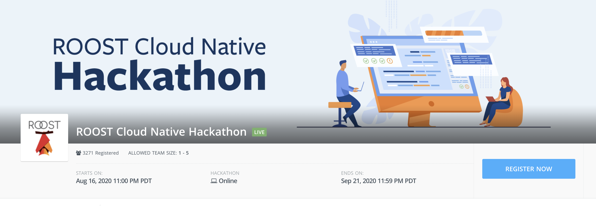

# Roost Hackathon Sample Submission Guide

Alice and Bob form a team to participate in Roost Hackathon. Alice is expertise in frontend development and Bob is in backend.

## How do Alice and Bob participate in Roost Hackathon

- Register for Roost Hackathon. [Registration Link](https://roost.hackerearth.com/)

- Both Sign-in to [roost.io](http://roost.io) and choose 'alice' & 'bob' as their respective roost handle.

- Download and install [Roost Desktop](http://roost.io/download) in their respective development machine.

- Alice uses her Roost Desktop to develop frontend microservices and ensure it is tested and working fine.

- Bob uses his Roost Desktop to develop backend microservices and ensure it is tested and working fine.

- Now it's time to integrate frontend microservice with backend service and Alice decides to share her service with Bob.

- Alice Requests a Push Access to Bob.

- Enter Bob's roost handle 'bob' and request push access. (Bob's Roost registered email address can also be used)

- Bob approves Alice's push request from his Roost Desktop.

- Alice build docker image of her frontend application.

- Alice creates a Kubernetes Deployment file to deploy her frontend microservice in ZKE Cluster and ensure her service is running as expected.

- Alice deploys frontend service on Bob's Roost Desktop by rightClick on deploy.yaml and select share and send it to Bob. Alice can see collaboration ZKE events in her Roost Desktop.

- Bob also gets COLLABORATION ZKE Events once deployment is received on his machine and can see the deployed frontend service in his workload analytics.

- Bob creates docker image of his developed backend microservice, creates his kubernetes manifests file to deploy in ZKE cluster.

- Bob deploys the backend microservice on his Roost Desktop and can see in Workload Analytics ensuring both the microservices are running.

- Bob demo the running microservices by opening the Frontend microservice URL from his development machine.
- Alice and Bob push their code in GitHub or Gitlab, create a video recording of their service building and service collaboration showing a demo. And they prepare a presentation to include application overview, architecture and include other information.

- At the end they are ready for Hackathon submission.

## Steps for Hackathon submission

- Once code is pushed to Github/GitLab, demo video or presentation is ready, sign in to https://roost.hackerearth.com and click on SUBMIT PROJECT.

- Add about project details, repository URL, video links, upload presentation and click on Submit for final submission.
