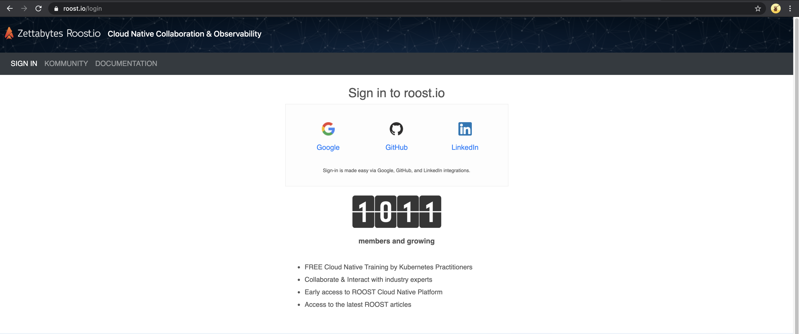
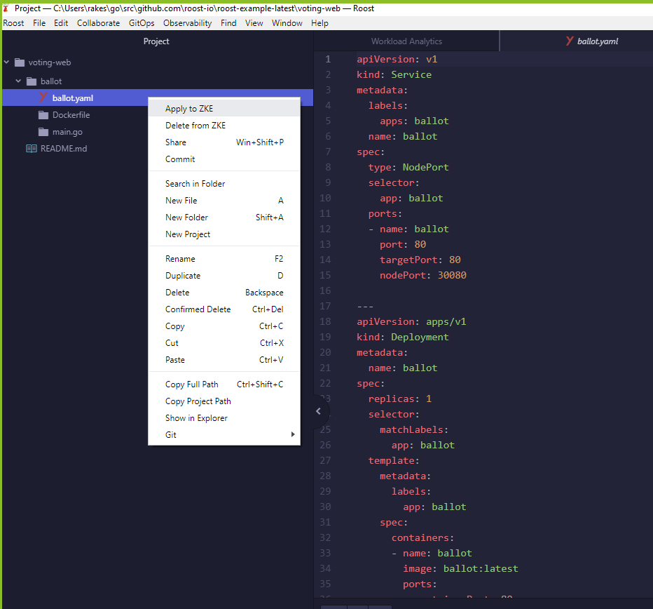

# Roost Hackathon Sample Submission Guide
Alice and Bob form a team to participate in Roost Hackathon. 
Alice brings web development experience and Bob is expert at writing API.

## 5 Steps for Alice and Bob to collaborate effectively in Roost Hackathon
 - Sign up at Roost Hackathon and Roost.io
 - Download and install Roost Desktop
 - Add each other to Roost Network
 - Develop and test microservice using Roost Desktop
 - Share Kubernetes Manifest using Roost Collaborate and enjoy an integrated application
 
 _*Finally, SUBMIT the project to [HackerEarth: Roost Hackathon](https://roost.hackerearth.com) for your chance to WIN.*_

## Step 1: Sign Up at Roost Hackathon and Roost.io
- Register for Roost Hackathon. [Registration Link](https://roost.hackerearth.com/)

- Both Sign-in to [roost.io](https://roost.io) and choose 'alice' & 'bob' as their respective roost handle.

## Step 2: Download and install Roost Desktop
- Download and install [Roost Desktop](http://roost.io/download) in their respective development machines.

- Follow the OS specific pre-requisites and launch Roost Desktop

## Step 3: Alice and Bob form a Roost Network
- Alice Requests a Push Access to Bob.

- Enter Bob's roost handle 'bob' and request push access. (Bob's Roost registered email address can also be used)

- Bob approves Alice's push request from his Roost Desktop.

- Likewise, Bob can request a Push Access to Alice.

## Step 4: Develop and unit-test microservice using Roost Desktop
- Alice uses her Roost Desktop to develop frontend microservices. This implies a Docker image and Kubernetes Manifest.

- Alice builds docker image for her frontend application. [voter/Dockerfile](voter/Dockerfile)

- Alice creates a Kubernetes Manifest [voter/voter.yaml](voter/voter.yaml) to deploy her frontend microservice in ZKE Cluster and complete her unit test.

- Bob also uses his Roost Desktop to develop backend microservices. This implies a Docker image and Kubernetes Manifest.

- Bob builds docker image for the backend application. [ballot/Dockerfile](ballot/Dockerfile)

- Bob creates a Kubernetes Manifest (ballot/ballot.yaml) to deploy backend microservice in ZKE Cluster and completes his test.

## Step 5: Time to collaborate and integrate
- Alice decides to share her front-end microservice with Bob.

- Alice right-clicks on voter.yaml and selects "Share" and sends it to Bob.

- Alice can see collaboration ZKE events in her Roost Desktop.

- Bob also gets COLLABORATION ZKE Events once deployment shared by Alice is received on his machine.

- Bob can see the deployed frontend service in his workload analytics.

- Bob already has his backend microservice running in Roost Desktop, so it is now 2 microservices running.

- Bob verifies the integration by opening the Frontend microservice URL from his development machine.

## Final step for Hackathon submission

- Alice and Bob push their code to a public GitHub or Gitlab repository.

- They document their microservices, inter-dependency and collaboration end-result. [RoostHackathon_Presentation.pdf](RoostHackathon_Presentation.pdf)

- Optionally create a video recording of their service building and service collaboration. (https://www.youtube.com/watch?v=flRl9b7W_Gc)

- Sign in to https://roost.hackerearth.com and click on SUBMIT PROJECT and upload the artifacts or share the repository URL (GitHub/GitLab)

